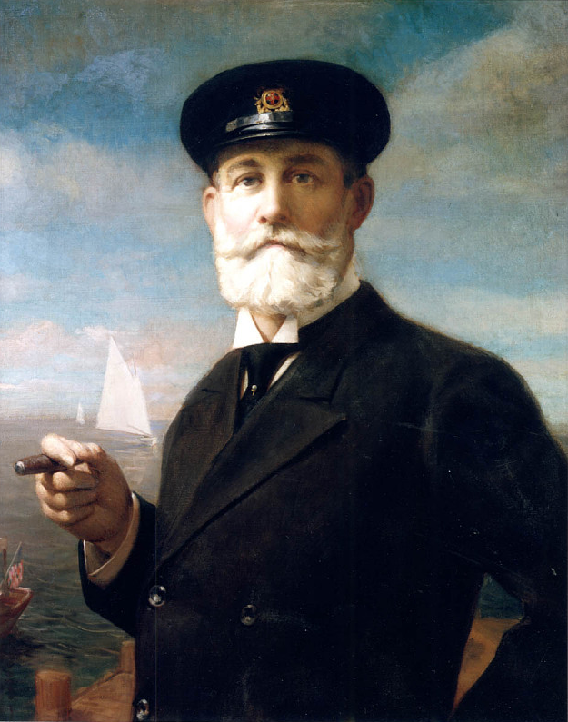

J. Walter Thompson is in the business of growing powerful brands with enduring, relevant and surprising relationship building ideas.

These ideas, owned by the brand, have traditionally been expressed through advertising.

Over the years JWT has built up certain principles of advertising development, based on understanding what it is that we've done when we've been particularly successful at building brands and creating advertising campaigns. Collectively these principles are called **The Thompson Way** and they have served us very well indeed in the past.

But the world of marketing has changed. Durable and service brands are now as important as the traditional packaged goods brands on which the original **Thompson Way** was based.

Brand communications have extended far beyond traditional advertising. Competition between brands is more intense than ever before, and from our experience around the globe we have learnt that the most successful are those which understand the essence of their relationship with consumers and reflect it in **all** their communications.

**The Thompson Way of Total Branding**, therefore, takes the original principles of **The Thompson Way** and adapts and expands them to be more relevant to these changed circumstances. It uses our new learning on effective integrated communications to increase significantly our understanding of how to optimise the relationship between brands and consumers through a total branding approach.

The fundamental principles of building brands and developing persuasive communications remain the same, rooted in an intimate knowledge of the consumer, a knowledge sufficiently deep that in the words of James Webb Young, we find...

**"...an individuality of relationship which leads to an idea".**

Using these principles, the key JWT Tools - **The Planning Cycle**, and **The Consumer Buying System** - have been evolved to take into account all product categories and forms of communication.

To these traditional Thompson cornerstones have been added two new **TOTAL BRANDING** concepts. **Brand Vision and Brand Idea.**

These go far beyond the traditional brand positioning statement to capture the essence of a brand's relationship with its consumers and bring it to life in a way which gives the brand added meaning and distinctiveness across all its communications activities.

To help us more fully exploit these concepts and better come to grips with all the implications of **TOTAL BRANDING**, we are introducing several new tools and ways of thinking as subsets to each of the five questions in the **Planning Cycle.** Together they encourage a search for superior **Insights** or **Discoveries** into consumers and how they respond to categories, brands and communications. These form the basis for identifying the **Brand Vision.**

One of the most exciting and stimulating of these tools we call a **"Day One"**.

**"Day One"** is a highly productive way of uncovering those **Discoveries**, creating insightful **Brand Vision** and turning them into involving **Branding Ideas.**

A **"Day One"** is a focused brainstorming session which captures the imagination and taps into the collective left and right brain talents of everybody on the Brand Team, from marketing to research, from account management, planning, media and creative to other key communication.

The final stage in the process is turning the **Brand Idea** into a **Total Communications Plan**, and to help us do so a series of new templates has been developed.

The **Branding Properties Audit, Creative Communication Briefs, Task Analyser** and **Vehicle Evaluator** help us decide which combination of activities will be most effective in communicating the **Branding Idea** and how best to evaluate them.

Together they recognize the complexities of **TOTAL BRANDING** and deal with them by breaking them into discreet thought processes. To this end the templates should be seen not as checklists, but as thought starts for innovative ideas.

The process of planning is an idea generating combination of rigorous analytical thinking and imagination, resulting in campaigns that are both innovative and internally coherent; a combination of **wisdom and magic.**

As such the **Thompson Way of TOTAL BRANDING**is designed to encourage us to think about communication opportunities and, as with its predecessor, we must look on it as a living document, not an irrevocable set of instructions carved in stone.

Its basic tenets remain:

- To be successful a brand must have an original positioning which provides its customers with a unique combination of functional and emotional benefits. This is powerfully expressed in the concept of **Brand Personality.**

- Since every successful brand has a unique consumer appeal, all communication activities should be custom-tailored to the brand and to the specific medium.

- Communication is an active, two-way, process, hence the focus of all communication planning should be first in terms of the response we want to achieve, not the message or stimulus. Communication is not about selling, but about making people want to buy.

- No one brand or idea can satisfy everybody. We must be precise in the definition of our target audience and the response we want from it. Equally only by setting clearly defined targets can we meaningfully evaluate the effectiveness of our activities.

We believe you will find the **Thompson Way of TOTAL BRANDING** a logical but exciting rebirth of the original **Thompson Way of ADVERTISING **- a coherent, practical, idea generating framework for maximising a brand's value by intensifying its relationship with its consumers in all its communication.
